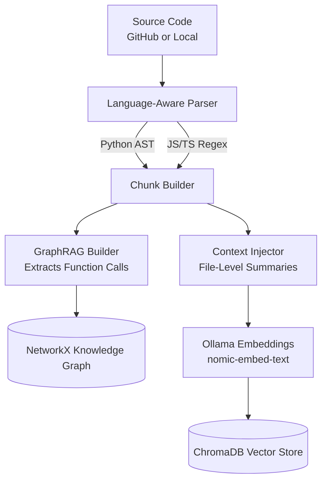
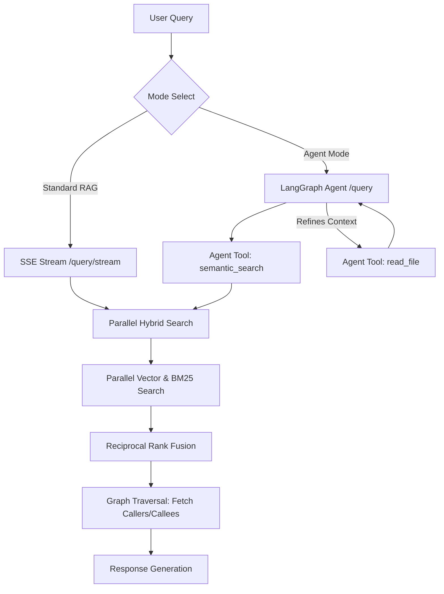

# RepoSage — Enterprise-Grade Codebase Intelligence System

RepoSage is a 100% offline, Agentic GraphRAG system designed for developers and engineering teams. By supplying a local directory path or a GitHub repository URL, users can query their codebase in natural language. The system autonomously retrieves context, traverses functional dependencies, and generates precise answers complete with exact file paths and line numbers.

[](https://python.org)
[](https://react.dev)
[](https://vitejs.dev)
[](https://fastapi.tiangolo.com)
[](https://langchain.com)
[](LICENSE)

---

## Overview

Traditional Retrieval-Augmented Generation (RAG) systems fail on complex codebases due to arbitrary character-limit splitting and an inability to understand structural dependencies. RepoSage overcomes these limitations by combining:

1. **Abstract Syntax Tree (AST) Chunking**: Code is parsed logically into atomic structural units (functions, classes) rather than arbitrary text chunks.
2. **Knowledge Graphs (GraphRAG)**: Function-call dependencies are mapped at ingestion time. During retrieval, the engine dynamically injects caller and callee contexts, virtually eliminating missing-dependency hallucinations.
3. **Autonomous Agentic Workflows**: Powered by LangGraph, the query engine operates autonomously, utilizing tools to execute semantic searches and proactively read specific files if further context is required.
4. **Real-time SSE Streaming**: Employs Server-Sent Events (SSE) to stream answers token-by-token directly to a modern, animated React frontend.

RepoSage operates entirely locally. It utilizes Ollama running reasoning models (such as `qwen3:4b` or `qwen2.5-coder:7b`), guaranteeing absolute privacy for proprietary codebases.

---

## Core Capabilities

- **State-of-the-Art Animated Frontend**: Rebuilt on React, Vite, Tailwind CSS, and Framer Motion with spring-physics charts, a technical mock terminal, and a collapsible dashboard sidebar.
- **Double Mode Query Engine**:
  - **Standard RAG Mode (SSE Streaming)**: Connects to `/query/stream` for near-instant, streamed token replies, complete with inline source tags.
  - **Agent Mode**: Leverages LangGraph to actively investigate complex codebase queries through iterative tool execution (`semantic_search` and `read_file`).
- **Parallelized Hybrid Search**: Executes dense vector retrieval (ChromaDB) and lexical keyword matching (BM25) in parallel using a python `ThreadPoolExecutor`, reducing I/O latency to <1s.
- **Fast Ingestion Traversal Walk**: Replaced file globbing with `os.walk` directory pruning to bypass skipped directories (`.git`, `node_modules`, `.venv`, etc.) in-place, dramatically speeding up repository indexing.
- **Contextual Retrieval (Anthropic Pattern)**: Auto-generates file-level summaries and prepends them to individual chunks, preserving macro-level context within micro-level retrievals.
- **Cache-Accelerated Summaries**: Caches high-level repository summaries (`summary_cache.json`) to skip LLM analysis runs on subsequent dashboard loads.
- **Precision Citation Badges**: Verifiable source locations formatted as interactive badges indicating `filename:line_number` in the chat window.
- **Query Expansion Toggle**: Set `ENABLE_QUERY_EXPANSION=false` to skip reasoning model query expansion, speeding up query execution for local setups.

---

## System Architecture

### Phase 1: Ingestion Pipeline



1. **Source Resolution**: Accepts public GitHub URLs (cloned via GitPython) or local folders.
2. **Pruned Ingestion traversal**: `os.walk` traverses files while ignoring excluded directories (`node_modules`, `.git`, `.venv`) before scanning, optimizing disk operations.
3. **Language-Aware Parsing**: Files are parsed to extract structural units. Python uses `ast`; JavaScript/TypeScript uses regex patterns.
4. **Graph Construction**: Constructs a NetworkX directed graph of function declarations and calls (`ast.Call`).
5. **Context Injection & Vector Persistence**: Computes file summaries and appends them to individual chunks, which are then embedded and saved in ChromaDB alongside the call graph.

### Phase 2: Query Pipeline (Dual Engine)



1. **Streaming SSE (Standard RAG)**: Sends query directly to `/query/stream`, which retrieves context, runs graph traversal, and streams tokens to the client immediately.
2. **Agentic Inference (Agent Mode)**: The LangGraph workflow controls Ollama, running semantic searches and iteratively invoking `read_file` tools to investigate code files.
3. **Parallel Retrieval**: BM25 and ChromaDB lookups execute in parallel on separate threads, merged through Reciprocal Rank Fusion (RRF) to keep total search time under 1s.
4. **Source citations**: Inline citation sources are delivered and rendered in real time on the UI.

---

## Getting Started

### Prerequisites

- **Python 3.11** or higher
- **Node.js 18** or higher (for the frontend)
- **Ollama** running locally
- **Git**

### 1. Model Configuration

Pull the necessary models via Ollama. By default, RepoSage utilizes `qwen3:4b` or `qwen2.5-coder:7b` for inference, and `nomic-embed-text` for embeddings.

```bash
ollama pull qwen3:4b
ollama pull nomic-embed-text
```

### 2. Environment Setup

Copy the environment template:

```bash
cp .env.example .env
```

Review and adjust variables:
```env
# Required: Ollama base url
OLLAMA_BASE_URL=http://localhost:11434
OLLAMA_MODEL=qwen3:4b
OLLAMA_EMBED_MODEL=nomic-embed-text

# Optional: Disable query expansion to speed up local queries
ENABLE_QUERY_EXPANSION=false

# Optional: Chroma persist directory
CHROMA_PERSIST_DIR=./chroma_db
```

---

## Running the Application

### Option A: Running Locally (Standard Setup)

#### 1. Backend Server (FastAPI)
Configure virtual environment and start FastAPI on port `8000`:
```bash
cd backend
python -m venv .venv

# Activate environment:
# Linux/macOS:
source .venv/bin/activate
# Windows:
.venv\Scripts\activate

pip install -r requirements.txt
python main.py
```

#### 2. Frontend Client (React + Vite)
In a new terminal window, install dependencies and start the Vite dev server on port `5173`:
```bash
cd frontend
npm install
npm run dev
```

Navigate to **[http://localhost:5173](http://localhost:5173)** in your browser.

---

### Option B: Running via Docker Compose

Docker Compose runs the frontend and backend in isolated containers.

1. **Set Environment Variables**:
   In your `.env` file, point the backend container to your host machine's Ollama instance:
   * **Windows/macOS:**
     ```env
     OLLAMA_BASE_URL=http://host.docker.internal:11434
     CHROMA_PERSIST_DIR=/app/chroma_db
     ```
   * **Linux:** Point to your bridge IP (typically `http://172.17.0.1:11434`).
   
   *Make sure Ollama is allowed to receive external network requests by setting the host environment variable `OLLAMA_HOST=0.0.0.0` and restarting Ollama.*

2. **Start the Containers**:
   ```bash
   docker compose up -d --build
   ```

3. **Access Services**:
   - **Frontend App**: `http://localhost:5173`
   - **Backend API Docs**: `http://localhost:8001/docs` (Note the backend container is mapped to port `8001` on the host system)
   - **Backend Health Check**: `http://localhost:8001/health`

---

## Project Structure

```text
reposage/
├── backend/
│   ├── main.py                     # FastAPI application entry point
│   ├── reposage/
│   │   ├── chunkers/
│   │   │   ├── python_chunker.py   # AST parser and Call Graph extraction
│   │   │   ├── js_chunker.py       # Regex JS/TS parser
│   │   │   └── generic_chunker.py  # Line-based fallback mechanism
│   │   ├── ingestion/
│   │   │   ├── repo_indexer.py     # os.walk traversal ingestion & ChromaDB indexer
│   │   │   ├── file_watcher.py     # Watchdog directory synchronization daemon
│   │   │   └── docstring_gen.py    # Chunk context summary generator
│   │   ├── query/
│   │   │   ├── agent_engine.py     # LangGraph autonomous agent workflow
│   │   │   ├── rag_engine.py       # Parallel Hybrid search and call graph traversal
│   │   │   └── query_transformer.py # Single-flow query expander & bypass toggle
│   │   └── analysis/
│   │       └── repo_summarizer.py  # Cached repository macro-analysis generator
│   └── requirements.txt
├── frontend/
│   ├── src/
│   │   ├── components/
│   │   │   ├── LandingPage.jsx     # Modern mock terminal & landing layout
│   │   │   ├── RepoDashboard.jsx   # Collapsible dashboard sidebar & file listing
│   │   │   └── ChatInterface.jsx   # Streaming SSE chat view & citation badge UI
│   │   ├── utils/
│   │   │   └── markdown.js         # Custom syntax-highlighting markdown parser
│   │   ├── App.jsx                 # Routing shell and global states
│   │   ├── index.css               # Tailwind & font styling rules
│   │   └── main.jsx                # React mount entrypoint
│   ├── package.json                # npm dependencies
│   ├── vite.config.js              # Vite configuration (port 5173)
│   └── Dockerfile                  # Lightweight Node.js build image
├── docker-compose.yml              # Production container config (Frontend: 5173, Backend: 8001)
├── .env.example                    # Template environment variables
└── README.md                       # Product documentation
```

---

## Testing

Execute the backend pytest suite:

```bash
python -m pytest backend/tests/ -v
```

---

## License

This project is licensed under the MIT License. See the [LICENSE](LICENSE) file for details.
